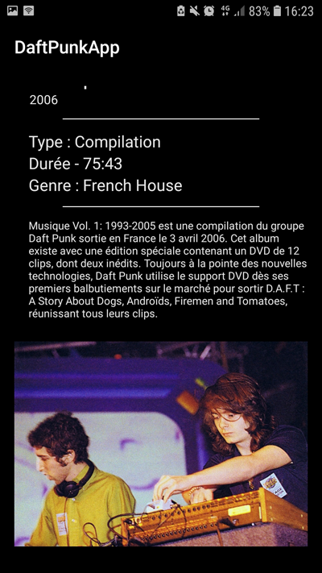

# Arnaud LAPY / 3A31 / Daft Punk App

## Description

Voici mon projet de 3A de programmation mobile démontrant l'utilisation de l'appel WebService à une API rest ansi que le stockage de données en cache.

Cette application affiche la discographie complette du groupe de French-House Daft Punk. Elle utilise une API hébergée sur GitHub contenant toutes les informations nécéssaires sur les différents projets du groupe.

## Consignes respectées :

* Appel WebService à une API Rest.
* Stockage de données en cache
* Ecrans : 3 activitées, 3 fragments
  *  *Affichage d'une liste dans une RecyclerView*
  *  *Affichage du détails d'un éléments* 
* Architecture : Singleton, MVC
* Autres fonctionnalités : Splash Screen

## Fonctionnalités :

### Ecran 1 : Splash Screen

* Splash screen affichant le logo des Daft Punk

### Ecran 2 : Home Screen

* Affiche la liste des projets de Daft Punk sous forme de grille

 

### Ecran 3 : détail du Disc

* Affiche les infomations sur le disc
 * Nom, type, durée et genre
 * Image de la pochette d'album
 * Description et mise en contexte sur le projet
 * Image en relation avec le projet

#### Exemple 1 : Random Access Memories

 

#### Exemple 2 : Musique Vol. 1 : 1993-2005

 

### Ajout d'une icône d'application

## Dévellopé sous 

* Android Studio

## Auteur

* **Arnaud LAPY** - *ESIEA/3A31 - 2020* - [Daft Punk App](https://github.com/arnaudlapy/TD3)

